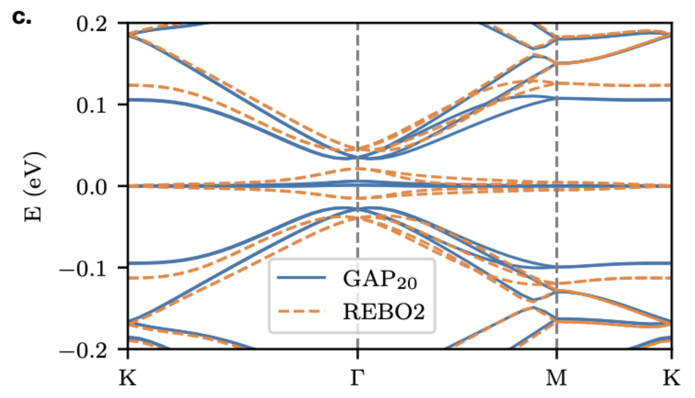
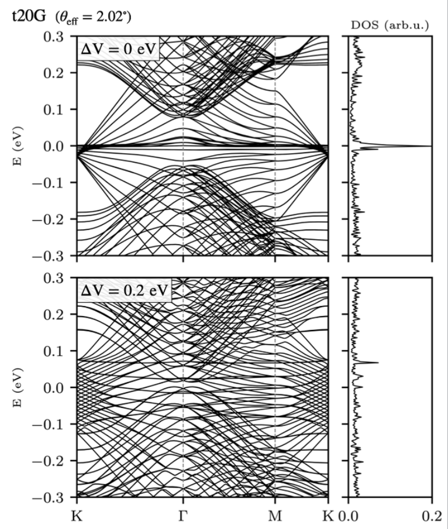
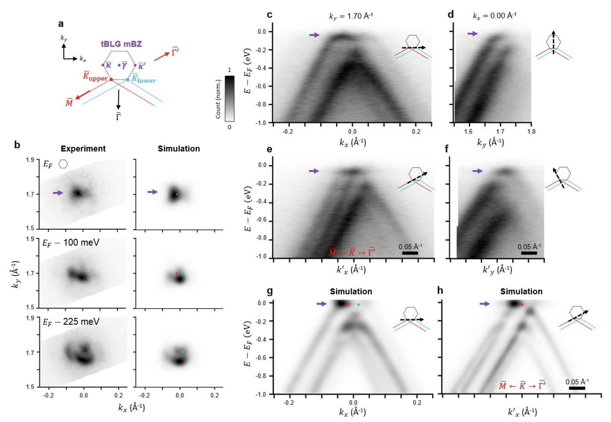

.. grabnes documentation master file, created by
   sphinx-quickstart on Wed Aug 31 11:03:59 2022.
   You can adapt this file completely to your liking, but it should at least
   contain the root `toctree` directive.

GRABNES's documentation
=======================

.. toctree::
   :maxdepth: 2
   :caption: Contents:

Description
-----------

This page aims to introduce you to the GRABNES package (GRAphene hBN Electrinic Structure). The name itself highlights the two standard materials that can be studied using this package, by layering them into meaningful configurations. Additional 2D materials can be included as well by modifying the code. One can already build straight out-of-the box GBN, twisted bilayer graphene, twisted multilayer graphene, hBN encapsulated single layer graphene, encapsulated bilayer graphene, etc. wher one can control the twist angle and the sliding between layers. Commensurate cells will be build to account for periodic boundary conditions.

In terms of Electronic Structure observables, one can calculate the electric band structure, the density of states (using Lanczos recursion as well as exact diagonalization), the unfolded spectral band structure, the local density of states, the probability density based on the wavefunction distribution, the Kubo-Greenwood conductivity, etc.

If you are familiar with the field of twisted bilayer graphene, you are probably aware that the relaxation effects play an important role intthe accurate assessment of the above observables. Hence, most of the calculations require an energy minimization step that can be routinely achieved using most Molecular Dynamics packages. We provide here the means to interface it with LAMMPS where LAMMPS reads in the commensurate cell provided by our package and our package reads in the relaxed positions from LAMMPS minimization output.

Getting started
---------------
GRABNES is a Fortran code. This can be daunting when you have never used this language, so to give you the opportunity to use the code without worrying about compilation issues and compiler questions, we have compiled a stable version of the code on Google Colab where you can interact with it using a Jupyter Notebook where Python is chosen as the language of choice.

Twistronics 2023
----------------

See :ref:`workshop` for the google Colab notebook that are used for the Twistronics 2023 Workshop.

Tutorial Files from Moire Course
--------------------------------
See :ref:`tutorial` for some previous jupyter notebooks. See Google Colab for better organized classes.

Installation
------------
The code is maintained on Github where you are free to clone or fork the stable or development versions of the code. Please refer to Github Documentation on how to do this. To install the code, one simply needs to modify the make.sys file to match the Compilers available on your system. The code has currently been tested using Intel Compilers. Add an empty .version file in the same folder as the make.sys file, then type ``make clean``, followed by ``make``.

Illustrations
-------------

Magic Angle Renormalization in Twisted Bilayer Graphene
^^^^^^^^^^^^^^^^^^^^^^^^^^^^^^^^^^^^^^^^^^^^^^^^^^^^^^^

We can calculate the electronic bandstructure of twisted bilayer graphene where we used our SHE model which is an improved Two-Center (TC) model which has been optimized to capture the DFT Tunneling at the K-point while allowing the user to tune it to capture the magic angle at a specific value. Here we set S so that the magic angle occurs at 1.08 degree when using the relaxed structures from an energy minimization using LAMMPS based on EXX-RPA-informed registry-dependent force fields. The intralayer terms used here in LAMMPS are either the widely used REBO2 forcefields or the machine-learning based GAP20 potential.

Twisted Multilayer Graphene Electric Bandstructures
^^^^^^^^^^^^^^^^^^^^^^^^^^^^^^^^^^^^^^^^^^^^^^^^^^^

A wide variety of layered materials can be considered in GRABNES. Here we implemented the Hamiltonian part of the code in such a way that a 20 layers twisted graphene system clearly showing the family of tBG bands that are expected in such tNG system. A flag in the GRABNES input file can be added to activate a perpendicular electric field.

Twisted bilayer graphene: band-unfolding
^^^^^^^^^^^^^^^^^^^^^^^^^^^^^^^^^^^^^^^^

Our code allows to calculate the band-unfolded band structures that can help to understand experimental ARPES measurements. Here we observe good agreement between the experimental features obtained using nano-ARPES and simulated features obtained using our package.

Comparison of experimental APRES data with simulated band unfolded data using GRABNES. Figure published in `Nature Physics`_.

.. _Nature Physics: https://www.nature.com/articles/s41567-020-0974-x

Graphene on h-BN: gap estimation
^^^^^^^^^^^^^^^^^^^^^^^^^^^^^^^^

h-BN encapsulated graphene: supermoire features
^^^^^^^^^^^^^^^^^^^^^^^^^^^^^^^^^^^^^^^^^^^^^^^

Percolating Impurity States in Defected Graphene
^^^^^^^^^^^^^^^^^^^^^^^^^^^^^^^^^^^^^^^^^^^^^^^^

GRABNES code
------------
The documentation for the code can be found here: :ref:`grabnes-code`. This is work in progress and is being generated with `sphinx-fortran`_.

.. _sphinx-fortran: https://pypi.org/project/sphinx-fortran/

Indices and tables
==================

* :ref:`genindex`
* :ref:`modindex`
* :ref:`search`
